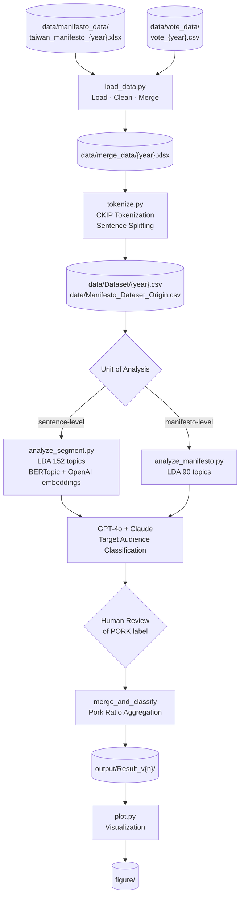

# The Impact of Electoral Reform on Legislators’ Campaign Strategies: An Application of Large Language Models

Master’s dissertation by **Peng-Ting Kuo**, Department of Political Science, National Taiwan University.

This repository contains all data pipelines, utility modules, and analysis scripts used in the research.

## Research Overview

This study analyzes Taiwan legislative election manifestos (1992–2024) across 10 elections to measure the ratio of pork-barrel vs. policy-oriented content, testing whether the 2005 SNTV→SMD electoral reform shifted legislators’ campaign strategies.

## Analysis Pipeline



## Project Structure

```
src/
├── pipeline/
│   ├── load_data.py          # Step 1: load + merge manifesto & vote data
│   ├── tokenize.py           # Step 2: CKIP tokenization (sentence splitting)
│   ├── analyze_segment.py    # Step 3a: segment-level BERTopic + LDA
│   └── analyze_manifesto.py  # Step 3b: manifesto-level LDA
├── utils/
│   ├── utils.py              # Data loading, cleaning, party coding
│   ├── utils_token.py        # CKIP tokenization helpers
│   └── utils_topic_modeling.py  # LDA/BERTopic helpers, AI classification, visualization
├── scripts/
│   ├── run_pipeline.sh       # End-to-end pipeline
│   └── run_plots.sh          # Plots only (requires completed output)
└── plot.py                   # Standalone plot entry point
Notebooks/                    # Interactive development notebooks (source of truth for analysis)
data/                         # Not tracked in git (see data/README.md)
output/                       # Not tracked in git
figure/                       # Output figures (tracked selectively)
```

## Setup

### 1. Install dependencies

```bash
pip install -r requirements.txt
```

> **Note:** `ckiptagger` requires a separate model-data download (~2 GB) to `CKIP_TAGGER/` at the repository root. See [ckiptagger documentation](https://github.com/ckiplab/ckiptagger).

### 2. Configure API keys

```bash
cp .env.example .env
# Edit .env with your OpenAI, Anthropic, and Google API keys
```

### 3. Run

**Reproduce thesis plots** (requires `data/Dataset.csv` with pre-computed pork ratios):
```bash
bash run.sh
```

**Full pipeline from raw data:**
```bash
bash src/scripts/run_pipeline.sh
```

**Individual steps:**
```bash
export PYTHONPATH="$(pwd)/src"
python src/pipeline/load_data.py --data_dir data
python src/pipeline/tokenize.py --data_dir data
python src/pipeline/analyze_manifesto.py --data_file data/Manifesto_Dataset_Origin.csv --save
```

## Key Design Decisions

- **Pork-barrel classification**: Topics are classified as pork (地區居民-targeted) vs. policy (nationally-scoped) using GPT-4o and Claude in parallel. Cases where the two models disagree (PORK_AI = -1) require human review.
- **Pork ratio**: Computed in two ways — WEIGHT (proportional to sentence length) and EQUAL (1/n sentences per candidate).
- **Serious candidates**: Defined by vote threshold (≥ 1/3 or 1/2 of winning votes per district) or major party membership. Minor candidates are excluded from the main analysis.
- **Electoral reform**: The 2005 shift from SNTV to SMD is the key discontinuity; TH 6 (2004) is pre-reform, TH 7 (2008) is post-reform.

## Notebooks

Jupyter notebooks in `Notebooks/` serve as the interactive source of record for the analysis. The `src/pipeline/` scripts are faithful standalone translations of those notebooks. **Do not modify the notebooks directly** — use the pipeline scripts for programmatic replication.

| Notebook | Corresponding script |
|---|---|
| `load_data.ipynb` | `src/pipeline/load_data.py` |
| `tokenization.ipynb` | `src/pipeline/tokenize.py` |
| `taiwan_analysis_segment.ipynb` | `src/pipeline/analyze_segment.py` |
| `taiwan_analysis_policy.ipynb` | `src/pipeline/analyze_manifesto.py` |

## Conference Presentations

| Date | Conference | Authors |
|---|---|---|
| 2024-06-18 | The 16th International Conference on Parliamentary Studies | **Peng-Ting Kuo**, Ronan Tse-Min Fu, Nick Lin |
| 2024-04-06 | The 81st Midwest Political Science Association | **Peng-Ting Kuo**, Ronan Tse-Min Fu |
| 2023-11-06 | 2023 Taiwanese Political Science Association | **Peng-Ting Kuo** |

## Published Journal
Forthcoming...

---
*All Rights Reserved by Peng-Ting KUO*
